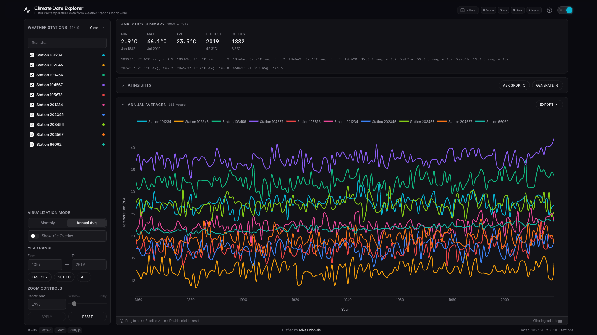
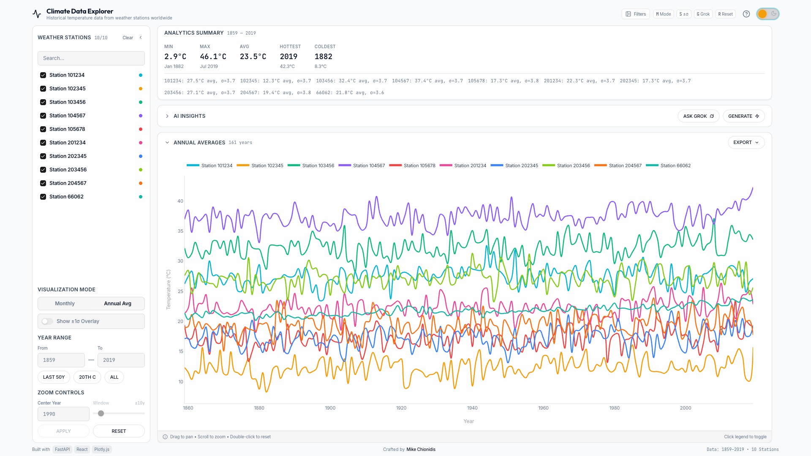
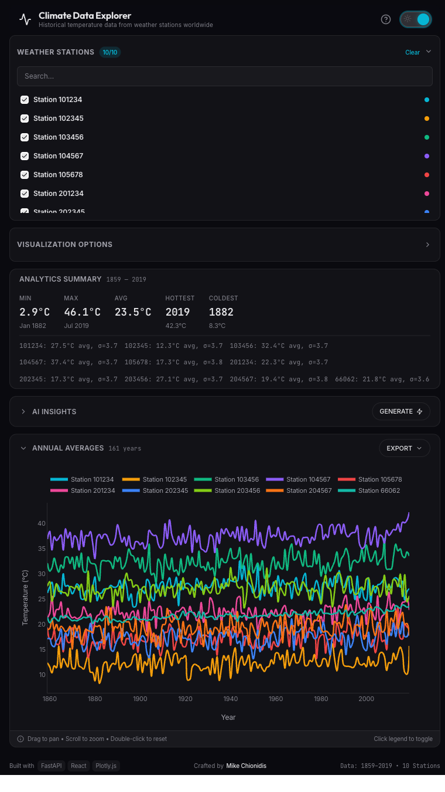
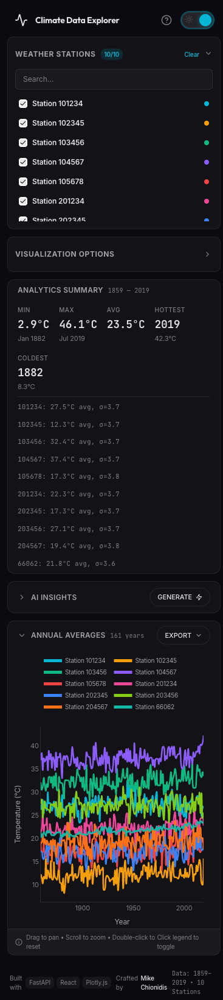
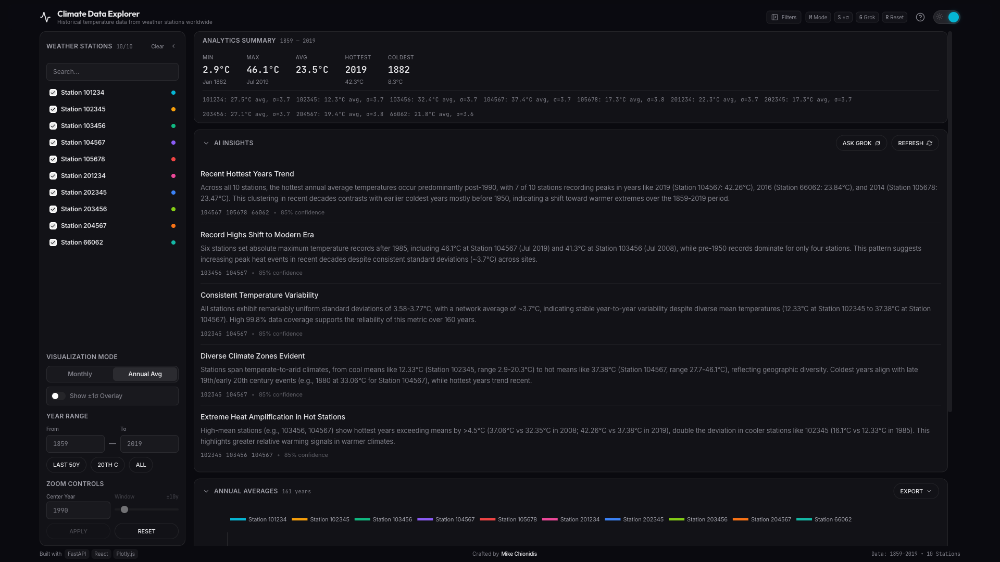
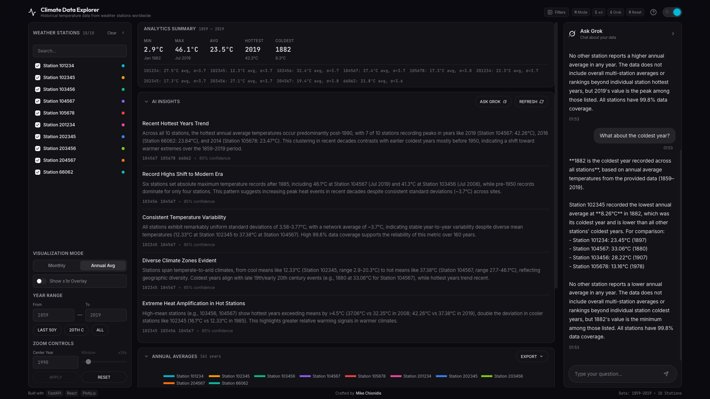
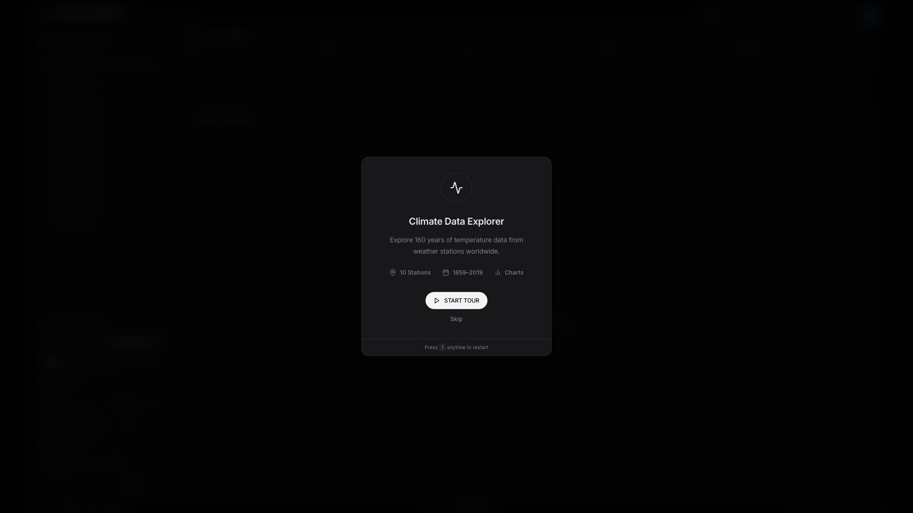
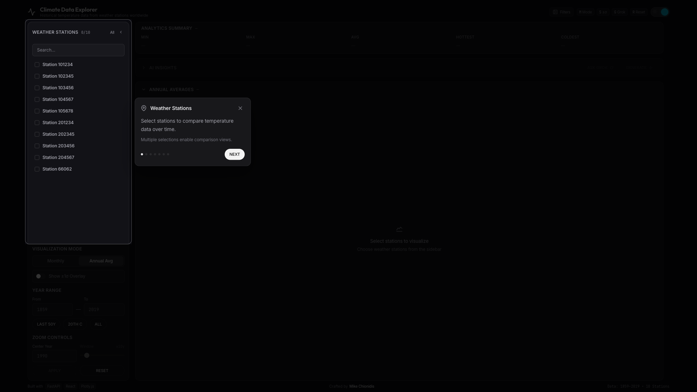

# Climate Data Explorer

[](https://github.com/mikechionidis/climate-data-viz/actions)
[](https://github.com/mikechionidis/climate-data-viz)
[](https://github.com/mikechionidis/climate-data-viz)
[](https://www.w3.org/WAI/WCAG21/quickref/)

A Tesla-level full-stack web application for exploring and visualizing 160 years of historical climate data from weather stations worldwide. Built with **FastAPI** and **React**, featuring **AI-powered insights via Grok (xAI)**, following **TDD** practices and **Domain-Driven Design**.



<details>
<summary>📱 Light Mode & Responsive Views</summary>

### Light Mode


### Tablet View (768px)


### Mobile View (375px)


</details>

<details>
<summary>🤖 AI Features & Onboarding</summary>

### AI-Powered Insights (Grok)


### Chat with Grok


### Onboarding Tour



</details>

## ✨ Key Features

### Data Visualization
- **Multi-station Selection**: Select and compare up to 10 weather stations simultaneously
- **Visualization Modes**:
  - **Monthly Data**: Display temperature data per month for each year
  - **Annual Averages**: Aggregate data as yearly averages (12x data reduction)
  - **±1σ Overlay**: Visualize standard deviation range around annual means
- **Interactive Chart**: Zoom, pan, scroll with Plotly.js
- **Export Options**: Download data as CSV or chart as PNG

### Analytics & AI
- **Statistical Summary**: Min, max, mean temperatures with date context
- **AI Insights**: On-demand analysis powered by **Grok (xAI)**
- **Chat with Grok**: Ask questions about your data in natural language
- **Conversation History**: Multi-turn conversations within a session

### User Experience
- **Responsive Design**: Optimized for desktop, tablet, and mobile
- **Dark/Light Theme**: System-aware with manual toggle
- **Guided Onboarding**: Interactive tour for first-time users
- **Keyboard Shortcuts**: `M` (mode), `S` (sigma), `G` (Grok), `R` (reset)
- **WCAG 2.1 AA Compliant**: Full accessibility support

## 🏗️ Architecture

### High-Level Overview

```
┌─────────────────────────────────────────────────────────────────────────────┐
│                         Frontend (React + TypeScript)                        │
│  ┌────────────────────────────────────────────────────────────────────────┐ │
│  │                    Feature-Based Architecture (DDD)                     │ │
│  │  ┌─────────────┐ ┌─────────────┐ ┌─────────────┐ ┌─────────────┐      │ │
│  │  │  stations/  │ │visualization│ │  analytics/ │ │     ai/     │      │ │
│  │  │  Sidebar    │ │  ChartPanel │ │  Analytics  │ │  Insights   │      │ │
│  │  │  Selector   │ │  Controls   │ │    Panel    │ │  ChatSidebar│      │ │
│  │  └─────────────┘ └─────────────┘ └─────────────┘ └─────────────┘      │ │
│  │  ┌─────────────┐ ┌─────────────────────────────────────────────┐      │ │
│  │  │ onboarding/ │ │               shared/                       │      │ │
│  │  │  Tour       │ │  components/ui, hooks, constants, types     │      │ │
│  │  └─────────────┘ └─────────────────────────────────────────────┘      │ │
│  └────────────────────────────────────────────────────────────────────────┘ │
│  App.tsx (158 lines) - Pure orchestration, composes features                │
└─────────────────────────────────────────────────────────────────────────────┘
                              │ HTTP/REST
                              ▼
┌─────────────────────────────────────────────────────────────────────────────┐
│                    Backend (FastAPI + Domain-Driven Design)                  │
│  ┌────────────────────────────────────────────────────────────────────────┐ │
│  │                           API Layer                                     │ │
│  │  router.py ──▶ aggregates all domain routers                           │ │
│  └────────────────────────────────────────────────────────────────────────┘ │
│  ┌────────────────────────────────────────────────────────────────────────┐ │
│  │                         Domain Layer                                    │ │
│  │  ┌───────────┐ ┌─────────────┐ ┌───────────┐ ┌─────────────────────┐  │ │
│  │  │ stations/ │ │climate_data/│ │ analytics/│ │         ai/         │  │ │
│  │  │  routes   │ │   routes    │ │   routes  │ │  routes + prompts   │  │ │
│  │  │  schemas  │ │   schemas   │ │   schemas │ │  service + schemas  │  │ │
│  │  │  service  │ │   service   │ │   service │ │  (Grok integration) │  │ │
│  │  └───────────┘ └─────────────┘ └───────────┘ └─────────────────────┘  │ │
│  └────────────────────────────────────────────────────────────────────────┘ │
│  ┌────────────────────────────────────────────────────────────────────────┐ │
│  │                        Services Layer                                   │ │
│  │  ┌─────────────────────┐  ┌────────────────────────────────────────┐  │ │
│  │  │  shared/            │  │  llm/                                  │  │ │
│  │  │  data_service.py    │  │  base.py (Protocol) + grok.py + mock  │  │ │
│  │  │  (CSV + caching)    │  │  (LLM abstraction layer)              │  │ │
│  │  └─────────────────────┘  └────────────────────────────────────────┘  │ │
│  └────────────────────────────────────────────────────────────────────────┘ │
│  ┌────────────────────────────────────────────────────────────────────────┐ │
│  │                      Core Infrastructure                                │ │
│  │  exceptions.py │ dependencies.py │ logging.py │ config.py              │ │
│  └────────────────────────────────────────────────────────────────────────┘ │
└─────────────────────────────────────────────────────────────────────────────┘
                              │
                              ▼
                    ┌─────────────────┐
                    │   CSV Dataset   │
                    │  (1859-2019)    │
                    └─────────────────┘
                              │
                              ▼
                    ┌─────────────────┐
                    │   Grok API      │
                    │   (xAI)         │
                    └─────────────────┘
```

### Backend: Domain-Driven Design

| Domain | Responsibility | Endpoints |
|--------|----------------|-----------|
| **stations** | Weather station listing | `GET /stations` |
| **climate_data** | Temperature data retrieval | `GET /data/monthly`, `GET /data/annual` |
| **analytics** | Statistical computations | `GET /analytics` |
| **ai** | AI-powered insights & Q&A | `POST /ai/insights`, `POST /ai/ask` |
| **shared** | Cross-domain data access | CSV loading, DataFrame caching |

### Frontend: Feature-Based Architecture

```
frontend/src/
├── features/                    # Feature modules (DDD-inspired)
│   ├── ai/                      # AI Insights & Chat
│   │   ├── components/          # AIInsightsPanel, ChatSidebar, InsightCard
│   │   └── hooks/               # useAIInsights
│   ├── analytics/               # Analytics Summary
│   ├── layout/                  # AppHeader, AppFooter, MobileLayout, DesktopLayout
│   ├── onboarding/              # Tour system (Context, Tooltip, WelcomeModal)
│   ├── stations/                # Station selection (Sidebar, StationSelector)
│   └── visualization/           # Chart & Controls (ChartPanel, ControlsPanel)
├── shared/                      # Shared utilities
│   ├── components/ui/           # Reusable UI components (13 components)
│   ├── hooks/                   # useFilters, useUIState, useKeyboardShortcuts
│   ├── constants/               # Centralized configuration
│   └── types/                   # TypeScript definitions
├── App.tsx                      # Pure orchestration (158 lines)
└── theme/                       # Theme configuration & chart styles
```

**Benefits:**
- ✅ **Scalable**: Easy to add new features as isolated modules
- ✅ **Maintainable**: Each feature is self-contained with its own components/hooks
- ✅ **Testable**: Features can be tested in isolation
- ✅ **Clean Imports**: Using `@/` path aliases for clean imports
- ✅ **Separation of Concerns**: App.tsx reduced from 593 to 158 lines (73% reduction)

## 🛠️ Tech Stack

### Backend
| Technology | Purpose |
|------------|---------|
| **FastAPI** | Modern Python web framework with automatic OpenAPI docs |
| **pandas** | Data processing and statistical computations |
| **Pydantic** | Data validation and serialization |
| **httpx** | Async HTTP client for Grok API |
| **pytest** | Testing framework with 81% coverage |
| **structlog** | Structured logging |

### Frontend
| Technology | Purpose |
|------------|---------|
| **React 18** | UI library with TypeScript |
| **Vite** | Fast build tool and dev server |
| **Chakra UI v3** | Accessible component library |
| **Plotly.js** | Interactive scientific charting |
| **TanStack Query** | Data fetching and caching |
| **Vitest** | Unit testing framework |

### Infrastructure
| Technology | Purpose |
|------------|---------|
| **Docker Compose** | Container orchestration |
| **GitHub Actions** | CI/CD pipeline |
| **Pre-commit hooks** | Code quality enforcement |
| **Nginx** | Frontend production serving |

## 📦 Project Structure

```
├── backend/
│   ├── app/
│   │   ├── api/
│   │   │   ├── router.py           # Aggregates domain routers
│   │   │   └── schemas.py          # Re-exports for backwards compat
│   │   ├── core/
│   │   │   ├── dependencies.py     # FastAPI DI
│   │   │   ├── exceptions.py       # Custom exceptions
│   │   │   └── logging.py          # Structured logging
│   │   ├── domains/                # ⭐ Domain-Driven Design
│   │   │   ├── shared/
│   │   │   │   └── data_service.py # CSV loading & caching
│   │   │   ├── stations/
│   │   │   │   ├── routes.py
│   │   │   │   ├── schemas.py
│   │   │   │   └── service.py
│   │   │   ├── climate_data/
│   │   │   ├── analytics/
│   │   │   └── ai/                 # 🤖 Grok integration
│   │   │       ├── routes.py
│   │   │       ├── schemas.py
│   │   │       ├── service.py
│   │   │       └── prompts.py
│   │   ├── services/
│   │   │   └── llm/                # LLM abstraction layer
│   │   │       ├── base.py         # Protocol definition
│   │   │       ├── grok.py         # Grok client
│   │   │       └── mock.py         # Mock for testing
│   │   ├── config.py
│   │   └── main.py
│   ├── data/
│   │   └── climate_data.csv
│   ├── tests/
│   │   ├── test_ai.py              # AI service tests
│   │   ├── test_llm.py             # LLM client tests
│   │   ├── test_analytics.py
│   │   ├── test_api.py
│   │   └── test_core.py
│   ├── Dockerfile
│   └── pyproject.toml
│
├── frontend/
│   ├── src/
│   │   ├── features/               # ⭐ Feature-based architecture
│   │   │   ├── ai/
│   │   │   ├── analytics/
│   │   │   ├── layout/
│   │   │   ├── onboarding/
│   │   │   ├── stations/
│   │   │   └── visualization/
│   │   ├── shared/
│   │   │   ├── components/ui/
│   │   │   ├── hooks/
│   │   │   ├── constants/
│   │   │   └── types/
│   │   ├── test/
│   │   │   ├── hooks/              # Hook tests
│   │   │   └── components/         # Component tests
│   │   ├── App.tsx
│   │   ├── main.tsx
│   │   └── theme/
│   ├── Dockerfile
│   └── package.json
│
├── docs/
│   └── images/                     # Screenshots
│
├── docker-compose.yml
├── docker-compose.dev.yml
├── .pre-commit-config.yaml
└── .github/workflows/
    ├── test.yml
    └── deploy.yml
```

## 🚀 Getting Started

### Prerequisites
- Docker & Docker Compose
- Node.js 20+ (for local frontend development)
- Python 3.11+ (for local backend development)
- Grok API key (optional, for AI features)

### Quick Start with Docker

```bash
# Clone the repository
git clone https://github.com/mikechionidis/climate-data-viz.git
cd climate-data-viz

# Create .env file for AI features (optional)
echo "GROK_API_KEY=your_api_key_here" > backend/.env

# Build and start the application
docker compose up --build

# Access the application
# Frontend: http://localhost:5173
# Backend API: http://localhost:8000
# API Docs: http://localhost:8000/docs
```

### Running Tests with Docker

```bash
# Run backend tests
docker compose run --rm backend-test

# Run frontend tests
docker compose run --rm frontend-test
```

### Local Development

#### Setup Pre-commit Hooks (Recommended)
```bash
# Install pre-commit
pip install pre-commit

# Install hooks (runs automatically before each commit)
pre-commit install

# Run manually on all files
pre-commit run --all-files
```

#### Backend
```bash
cd backend

# Create virtual environment
python -m venv .venv
source .venv/bin/activate  # On Windows: .venv\Scripts\activate

# Install dependencies
pip install -e ".[dev]"

# Create .env file for AI features
echo "GROK_API_KEY=your_api_key" > .env

# Run linting
ruff check app tests
ruff format app tests

# Run tests with coverage
pytest --cov=app --cov-report=term-missing

# Start development server
uvicorn app.main:app --reload --port 8000
```

#### Frontend
```bash
cd frontend

# Install dependencies
npm install --legacy-peer-deps

# Start development server
npm run dev

# Run tests
npm run test:coverage

# Build for production
npm run build
```

## 📡 API Endpoints

### Data Endpoints

| Endpoint | Method | Description |
|----------|--------|-------------|
| `/api/v1/stations` | GET | List all weather stations |
| `/api/v1/data/monthly` | GET | Get monthly temperature data |
| `/api/v1/data/annual` | GET | Get annual averages with std |
| `/api/v1/analytics` | GET | Get statistical summary |

### AI Endpoints

| Endpoint | Method | Description |
|----------|--------|-------------|
| `/api/v1/ai/insights` | POST | Generate AI insights for data |
| `/api/v1/ai/ask` | POST | Ask questions about data |

### Query Parameters

**GET /api/v1/data/monthly**
- `stations` (required): Comma-separated station IDs
- `year_from` (optional): Start year filter
- `year_to` (optional): End year filter

**POST /api/v1/ai/insights**
```json
{
  "station_ids": ["66062", "101234"],
  "year_from": 1950,
  "year_to": 2019
}
```

**POST /api/v1/ai/ask**
```json
{
  "question": "What is the warmest year?",
  "station_ids": ["66062"],
  "conversation_history": []
}
```

## 🧪 Testing Strategy (TDD)

This project follows **Test-Driven Development** practices:

### Backend Tests (81% coverage)
- **Unit Tests**: AI service, LLM clients, analytics functions
- **Integration Tests**: API endpoints with test data
- **Coverage Threshold**: Minimum 80% enforced in CI

```bash
# Run backend tests with coverage
cd backend
pytest --cov=app --cov-report=html --cov-fail-under=80
```

### Frontend Tests (56 unit tests)
- **Hook Tests**: useFilters (20 tests), useUIState (11 tests)
- **Component Tests**: PillButton (13 tests), CollapsibleSection (8 tests)
- **Integration Tests**: App rendering

```bash
# Run frontend unit tests
cd frontend
npm run test:coverage
```

### E2E Tests (16 tests with Playwright)
- **Desktop Tests (8)**: Layout, station selection, chart display, mode toggle, sigma overlay, year presets, theme toggle, sidebar collapse, keyboard shortcuts
- **Mobile Tests (8)**: Responsive layout, touch controls, visualization options, scrolling, analytics display

```bash
# Run E2E tests
cd frontend
npm run test:e2e

# Run only desktop tests
npm run test:e2e:desktop

# Run only mobile tests
npm run test:e2e:mobile

# Run with UI mode
npm run test:e2e:ui
```

## ♿ Accessibility (WCAG 2.1 AA)

The application is fully accessible:

- ✅ **Skip Links**: Navigate directly to main content, stations, or chart
- ✅ **Keyboard Navigation**: Full keyboard support with visible focus indicators
- ✅ **Screen Reader Support**: ARIA labels, live regions, semantic HTML
- ✅ **Color Contrast**: All text meets 4.5:1 contrast ratio
- ✅ **Reduced Motion**: Respects `prefers-reduced-motion`
- ✅ **High Contrast Mode**: Enhanced visibility support

**Keyboard Shortcuts:**
| Key | Action |
|-----|--------|
| `M` | Toggle Monthly/Annual mode |
| `S` | Toggle ±1σ overlay |
| `G` | Open Grok chat |
| `R` | Reset zoom |
| `?` | Restart tour |

## 🔄 CI/CD Pipeline

The project uses GitHub Actions for continuous integration:

1. **Pre-commit Checks** (first gate):
   - Code formatting (Ruff)
   - Linting
   - Type checking (mypy)

2. **On Push/PR**:
   - Run backend tests with coverage (80% threshold)
   - Run frontend tests and type checking
   - Build Docker images
   - Integration tests with Docker Compose

3. **On Release**:
   - Build production images
   - Push to container registry
   - Deploy to AWS

## 🌿 Git Workflow

This project follows **trunk-based development** with conventional commits:

```bash
# Create feature branch
git checkout -b feature/your-feature-name

# Make changes and commit (using conventional commits)
git commit -m "feat: add new visualization mode"

# Push and create PR
git push origin feature/your-feature-name
```

### Conventional Commits
- `feat:` - New features
- `fix:` - Bug fixes
- `docs:` - Documentation changes
- `test:` - Test additions/changes
- `refactor:` - Code refactoring
- `chore:` - Maintenance tasks
- `style:` - Styling changes

## 📊 Design Decisions

### Why Domain-Driven Design?
- **Encapsulation**: Each domain is self-contained with its own routes, schemas, and services
- **Scalability**: Adding new features = adding new domains
- **Team-friendly**: Clear boundaries for parallel development
- **Maintainability**: Find code by feature, not by layer

### Why Feature-Based Frontend Architecture?
- **Mirrors Backend DDD**: Consistent mental model across stack
- **Scalable**: Easy to add/remove features
- **Testable**: Each feature can be tested in isolation
- **Clean App.tsx**: Reduced from 593 to 158 lines (73% reduction)

### Why In-Memory Data (pandas) vs Database?
- **Simplicity**: ~19,200 rows (160 years × 12 months × 10 stations) fits easily in memory
- **Performance**: No I/O overhead, instant filtering and aggregations
- **Scalability Note**: For production with millions of records, would migrate to TimescaleDB

### Why Grok for AI?
- **Tesla Ecosystem**: Grok is Elon Musk's AI, perfect fit for Tesla project
- **Protocol-Based**: LLM abstraction layer allows easy swapping to other providers
- **Mock Client**: Testing without API calls

### Why Plotly.js?
- **Scientific Focus**: Built-in zoom, pan, hover with data inspection
- **Statistical Charts**: Native support for error bars, shaded regions (±σ)
- **Interactivity**: Rich interactions without custom implementation

## 🚧 Future Improvements

- [ ] Real-time weather API integration
- [ ] Predictive trend analysis with ML
- [ ] User presets/bookmarks
- [ ] Comparison mode (side-by-side stations)
- [ ] Export to PDF reports

## 📄 License

MIT License - see [LICENSE](LICENSE) for details.

---

**Crafted by [Mike Chionidis](https://mikechionidis.com)** for Tesla's Full Stack Engineering assessment.
